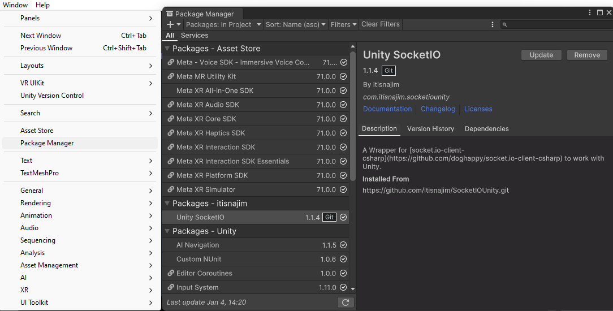
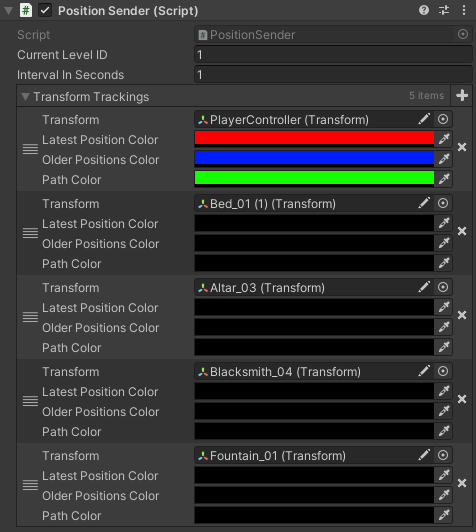

## Installation and Setup

### Prerequisites

Before you begin, ensure you have the following installed:

- **Docker** and **Docker Compose**
- **Git** (to clone the repository)

### Docker Setup

1. **Clone the Repository**

    ```
    git clone https://github.com/cyberspace-lab/cyberframe-webcontroller.git
    ```

    ```
    cd webcontroller
    ```

2. **Build and Run the Docker Containers**

    ```
    docker-compose up --build
    ```

    This command will:

    - Build the Flask backend and Vue frontend images.
    - Start the Nginx reverse proxy.
    - Expose the necessary ports.

Now you can access the application at the address **`{APPLICATION_ADDRESS}/activesessions`** where a list of all currently connected game sessions will be displayed.

---

## Application Configuration

The application needs to be configured for each experiment in the file `./vue-frontend/src/config.json`, which follows this structure:

- **applications**: A dictionary of applications with their specific settings.
  - **Application Name** (e.g., `"MoveDifferent"`):
    - **controlButtons**: Defines buttons that send commands to Unity clients.
    - **receivers**: Specifies data keys and history limits expected from Unity clients. Just a list of names of data types that are expected to be recieved from Unity app and will be shown in the session detail.
    - **levels**: Contains details about levels/scenes, including map images and real-world dimensions.

- **min_free_memory_percentage**: The minimum percentage of free memory required before cleaning up inactive sessions begins.

---

#### Button Definition

Each button has the following properties:

- **title**: The button's label.
- **requiresInput**: Indicates if the button requires dynamic input for parameters.
- **inputPlaceholder**: Placeholder text for the input field.
- **payload**:
    - **eventName**: The name of the command.
    - **parameters**: Parameters for the command.
- **context**: A list of context names in which the button will appear. If left empty, the button will always be visible.

**Important**: Dynamic input parameter is accessible in the Unity with the key ```"userInput"```.

---

#### Data Definition

- **Data Type Name** (e.g., `currentScene`):
  - **maxHistory**: The number of previous records to store (default is 10).

If you want to display a level map and track player positions, you must define the data type `position`. This type is internal, other types are be custom.

---

#### Level Map Definition

Each level map is defined with the following properties:

- **Level Index** (e.g., "1"):
    - **url**: The URL of the map image.
    - **realWidth**: The actual width of the map in Unity units.
    - **realHeight**: The actual height of the map in Unity units.
    - **mapOffsetX**: Offset for the x-coordinate to calibrate positions.
    - **mapOffsetY**: Offset for the y-coordinate to calibrate positions.
    - **mapOffsetRotation**: Offset for rotation (in degrees) to calibrate positions.

---

#### **Configuration Example**

```json
{
  "applications": {
    "MoveDifferent": {
      "controlButtons": [
        {
          "title": "Set participant name",
          "requiresInput": true,
          "inputPlaceholder": "Participant",
          "payload": {
            "eventName": "participantName",
            "parameters": {}
          },
          "context": ["menu"]
        },
        {
          "title": "Start Test Teleport",
          "payload": {
            "eventName": "startLevel",
            "parameters": { "settingsIndex": 0 }
          },
          "context": ["menu"]
        },
        {
          "title": "Start/Stop Experiment",
          "payload": {
            "eventName": "startStopExperiment",
            "parameters": {}
          },
          "context": ["level"]
        }
      ],
      "receivers": [
        {
          "currentScene":{ "maxHistory": 10 },
          "location":{ "maxHistory": 20 },
          "position":{ "maxHistory": 10 }
        }
      ],
      "levels": [
        {
          "1": {
            "url": "https://i.ibb.co/PCLSBCJ/map-dungeon.png",
            "realWidth": 25.5,
            "realHeight": 26.5,
            "mapOffsetX": -0.7,
            "mapOffsetY": 3.3,
            "mapOffsetRotation": -90
          }
        }
      ]
    }
  },
  "min_free_memory_percentage": 20
}

```

---

## Integration of Unity Package  

WebController Unity package facilitates communication between the game session and the server. This package includes **five scripts**, which need to be added to the Unity project. It requires the **Socket.IO library**, which can be downloaded via the **Package Manager** in Unity using the link:  
`https://github.com/itisnajim/SocketIOUnity.git`.



---

#### Key Script: **WebControllerManager**
This is the main script of the package and must be attached to an object in the **main starting scene** of the project. Subsequent scenes should be accessed from this starting scene. The object with **WebControllerManager** persists across scenes, ensuring only one instance exists throughout the project.

**Configuration in Inspector**:

  - **serverURL**: URL of the server (e.g., `http://localhost`).
  - **port**: Server port. Default port is 4000.
  - **sessionName**: Name of the experiment session.
  - **reconnectionTime**: Time interval (in seconds) for retrying server connections after disconnection.
  - **Debug options**:
    - `debug`: Logs connection-related messages to the Unity console.
    - `useLocalhost`: Overrides `serverURL` with `http://localhost`.


If `sessionName` is not provided, the app uses the Unity project name as the default experiment name.

**Important**: The experiment name must match the application name set in the web app configuration.

Once configured, the game session automatically connects to the server.

---

#### Sending Data to the Server
To send data, call the static method:
```csharp
WebControllerManager.SendData(string key, string value);
```  

- **`key`**: The data type name, matching the one defined in the web app configuration under `receivers`.
    - Reserved keys: `position` and `context` (cannot be used).
- **`value`**: The data value, provided as a string.

Data will be displayed in the session detail page.

**Example**:
```csharp
public void TakeDamage(int damage)
{
  this.health -= damage;
  WebControllerManager.SendData("damage_taken", damage);

  if (this.health <= 0)
  {
    WebControllerManager.SendData("player_event", "Player was killed");
    KillPlayer();
  }
}
```  

---

#### Receiving Commands from the Server
By clicking a button in the control panel of a session detail page in the web application, the server will send a command with parameters to the Unity session.

To handle commands from the server:

1. Attach the **GenericEventListener** script to an object in the scene.
2. In the **Inspector**, configure the `events` section:
    - Define the event **name** (matching the button configuration in the web app).
    - Assign an **action** (method to be called when the command is received).


**Supported Method Types**:

- Without parameters.
- With a single parameter of type `WebControllerCommand` (a wrapper for a dictionary).

If the command includes parameters, extract them from the dictionary using the parameter name (key). The values are of type `object`.

**Example**:
```csharp
public void ReceiveParticipantName(WebControllerCommandParameters parameters)
{
  string name = (string)parameters["name"];
  this.textbox.text = name;
}

public void SetAndStartLevel(WebControllerCommandParameters parameters)
{
  int levelID = (int)parameters["levelID"];
  Logger.Log("Starting level with ID:" + levelID);
  StartLevel(levelID);
}

//example of method without parameter
public void ResetPlayersPosition()
{
  player.transform.position = new Vector3(0, 0, 0);
}
```

**Important**: Dynamic input is accessible with the key ```"userInput"```.

---

#### Changing Contexts for Buttons
Buttons in the control panel of a detail of a session in the web application can have some context defined in which they will be shown.

To set these contexts call the static method:
```csharp
WebControllerManager.SetContext(string[] values);
```
- **`values`**: An array of current context names.
- Buttons in the web app with at least one matching context name (or no defined context) will be displayed.

**Example**:
```csharp
WebControllerManager.SetContext(new string[] { "menu", "player_controls" });
``` 

---

#### Sending Player and Object Positions
To send positions that will be shown in realtime on the map in the web application:

1. Attach the **PositionSender** script to an empty object in the scene.
2. Configure in the **Inspector**:
    - **currentLevelID**: Identification number for the current level. This ID will be used in the web application for selecting the correct map image.
    - **intervalInSeconds**: Interval (in seconds) for sending positions.
    - **transformTrackings**: List of objects to track, including:
        - References to the objects.
        - Colors for the last position, previous positions, and movement trails.

---



This setup ensures seamless communication and integration between Unity projects and the server, enabling real-time interaction, data sharing, and experiment management.