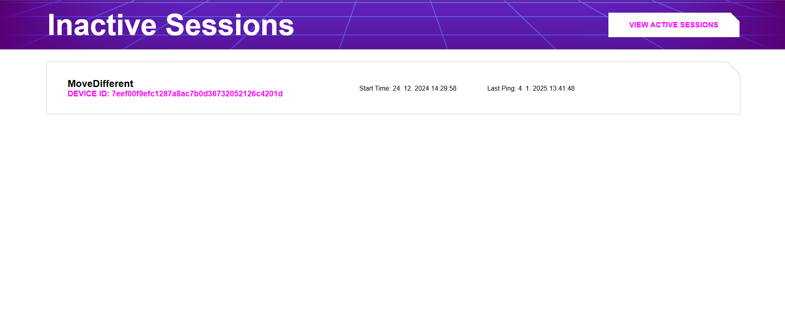
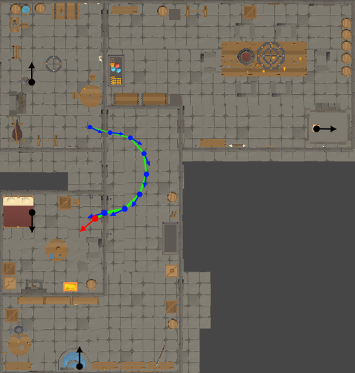

## Active Session List

At the address `"{APPLICATION_ADDRESS}/activesessions"`, you can view a list of all currently connected game sessions. The list contains the name of the session, the device identification number on which the game session is running, the connection time, and the last data update time. By clicking on a session item, you will be redirected to its details page. Clicking on the button in the top right corner, "VIEW INACTIVE SESSIONS," will redirect you to the list of inactive game sessions.

## Inactive Session List

At the address `"{APPLICATION_ADDRESS}/inactivesessions"`, you can view a list of all past game sessions that are currently disconnected. The list contains the session name, the device identification number on which the game session was running, the connection time, and the last data update time. By clicking on a session item, you will be redirected to its details page. Clicking on the button in the top right corner, "VIEW ACTIVE SESSIONS," will redirect you to the list of active game sessions.

## Active Session Detail

The game session details are available by clicking on a session from the list of active game sessions. The page is divided into four parts:

- In the top left corner, you can see the experiment name, the device identification number on which the game session is running, the connection time, the last data update time, a button to return to the active session list, and a button to save the game session data in JSON format.
- In the bottom left part, there is a map of the current level, including the positions and rotations of the monitored players and levels. The map updates in real-time.
- In the top right part, there is a control panel with buttons for commands defined in the configuration file. When a button is clicked, the corresponding command is sent to the game session. If the command has a dynamic parameter, a text box will appear next to the button where you can input the parameter, and then click the button to send it.
- In the bottom right part, there is a list of all received data from the game session except for the position (which is displayed on the map or can be downloaded with the other session data). To show or hide previous received data, you must click on the specific data. The received data updates in real-time.

## Inactive Session Detail

The details of an inactive game session are available by clicking on a session from the list of inactive game sessions. It is the same as the details of an active game session except for two differences:

- The control panel is not displayed because a disconnected session cannot be controlled.
- A button is added to delete the game session from the server's memory and disk. Deletion is irreversible.

## Control Panel

The control panel is located in the top right corner of the active game session details page. All buttons for the current context are displayed here. If the button expects a parameter to be filled, a text box will appear next to it where the parameter can be entered. When clicked, the button’s command, possibly along with the parameter, will be sent to the server. The parameter can be dynamic from the text box or static, as defined in the configuration file. The command may be without a parameter or, in the case of a static parameter, there may be several.

## Map and Position Tracking

The map is displayed in the bottom left part of the session details page. It shows the positions and rotations of all monitored players and objects in real-time. When the level changes, the map image updates automatically. To display the map, it is necessary to define the type of incoming data as "position" in the configuration file. The map shows the latest positions as well as several previous positions, the number of which can be defined in the configuration. Positions are connected by a line that represents the movement path. Each position is shown as a dot with an arrow indicating the rotation. Older positions are always drawn with smaller dots and arrows. In the Unity package, you can define different colors for each monitored object and also different colors for the latest position, older positions, and the movement path. The Unity package also defines the interval for sending positions.

## Configuration edit

The configuration edit interface allows you to securely view, modify, and save the application's configuration file directly from the browser. Accessible via the session details page, this section provides a textarea where the JSON configuration can be edited manually. Users must enter a valid password to load the current configuration or to save any changes made.

The interface includes built-in validation to ensure the configuration structure is correct before saving. It checks for required fields such as `applications`, `controlButtons`, `receivers`, `levels`, and system thresholds like `min_free_memory_percentage`. Each application's components are validated individually to prevent errors that could disrupt session handling or map rendering.

## Testing with Fake Data

The communication between the frontend and the backend, as well as data display on the frontend, can be easily tested at the address `http://localhost:4000/test` during local development. By filling in a fake experiment name and fake device identification number, you can create a fake session on the server. You can also send fake data to a specific session based on the device identification number.

